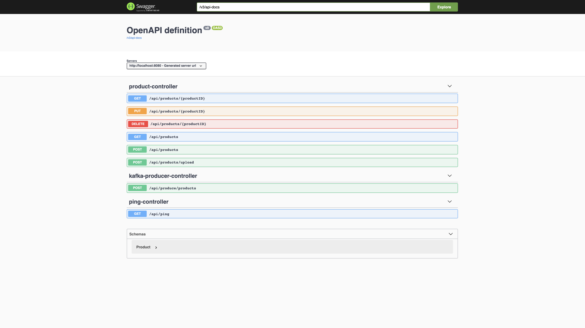
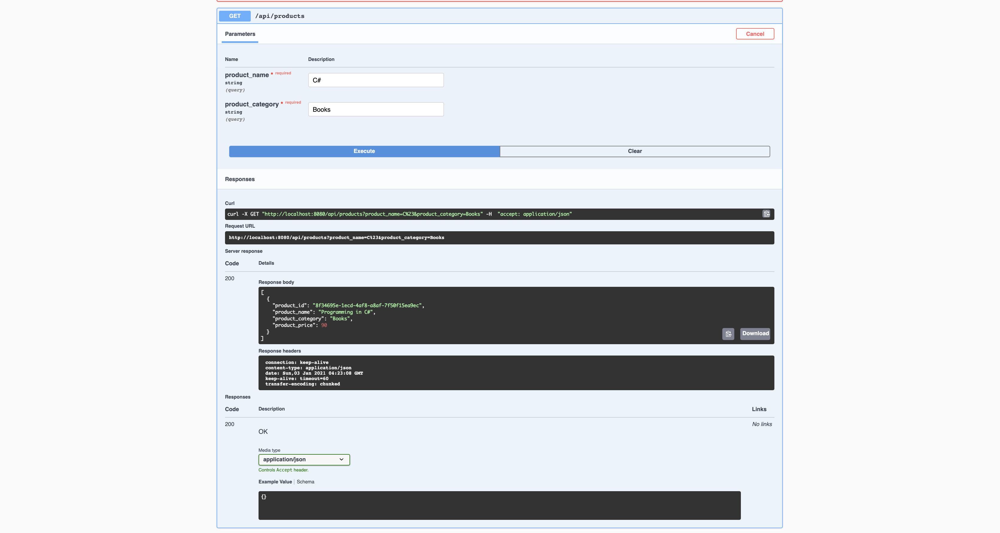
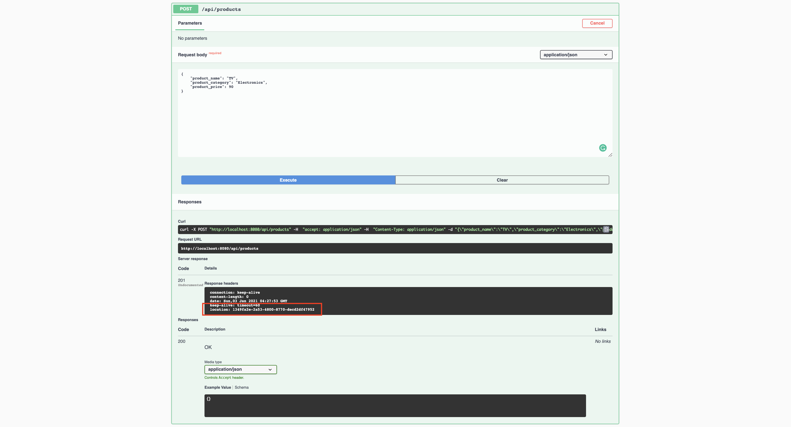
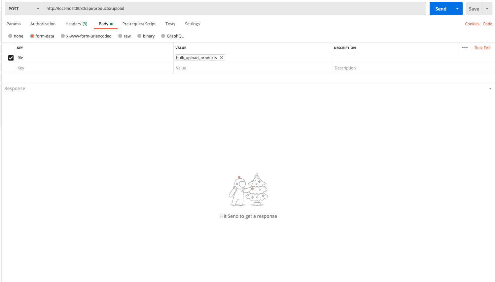
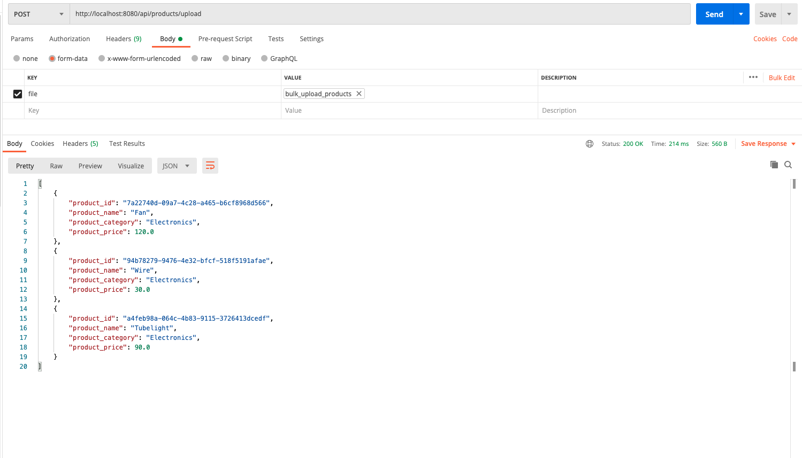
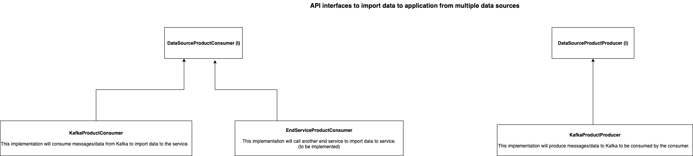
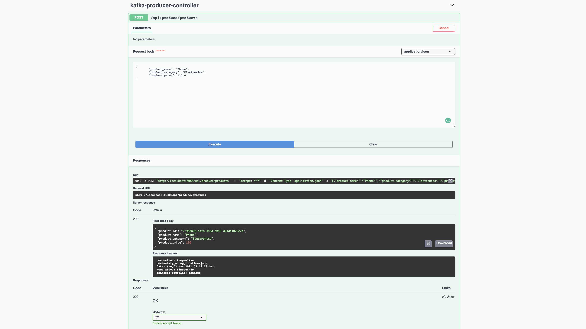
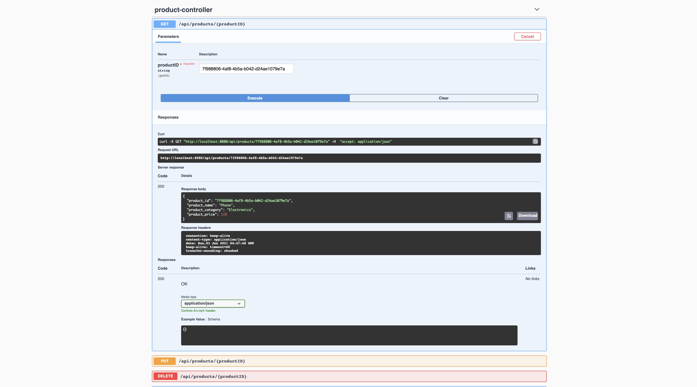

# product_comparison_service

This application compares products based on names and categories from different sources.

 

## Commands to run the application on Docker:

##### 1. To build a Docker image using docker-compose.yml:

`docker-compose up --build`

##### 2. To stop the running containers: 

`docker-compose down`

# Scope of given task:

### 1. API Swagger Documentation:

### 2. Service endpoint that fetches products based on given name and category:  

## Data Import scenarios:

### 1. Service endpoint to add a single product:

 

### 2. Service endpoint to upload products in bulk:

###### This endpoint accepts a file as input to upload products in bulk.

 

### 3. DataSourceProductConsumer to consume products from multiple data sources:

 

#### 3.1 KafkaProducer to simulate message-broker as data source scenario:

#### 3.2 Service endpoint to get the consumed product:

